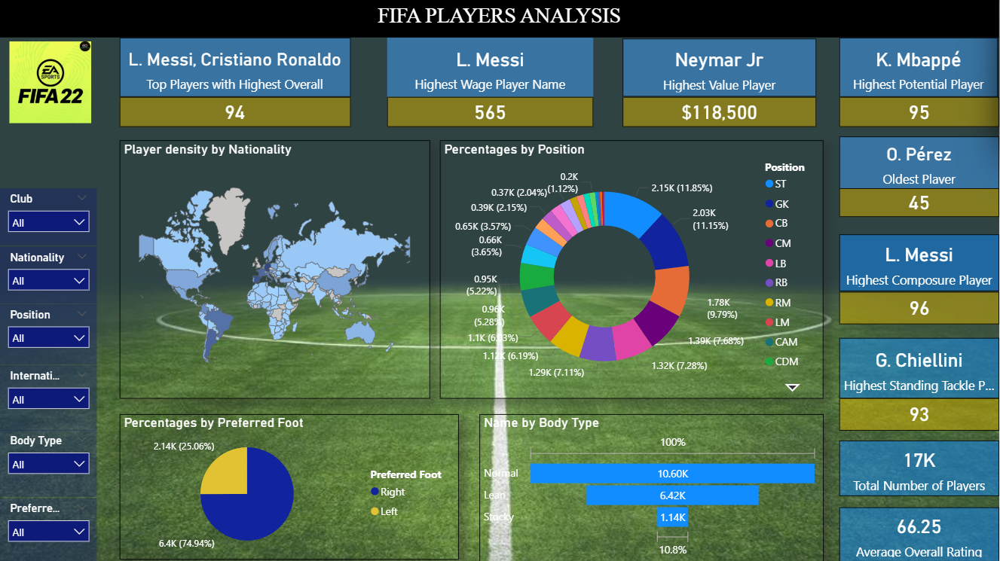
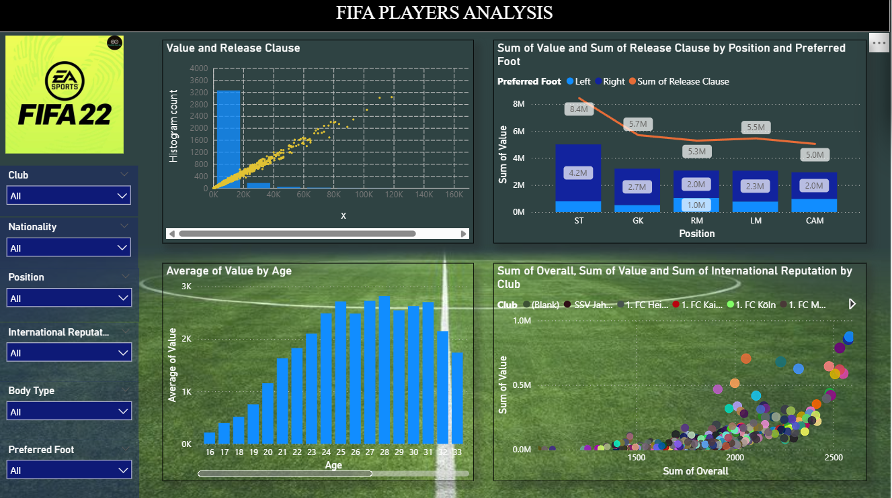
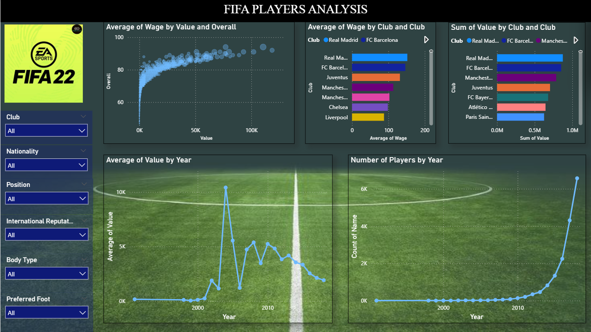
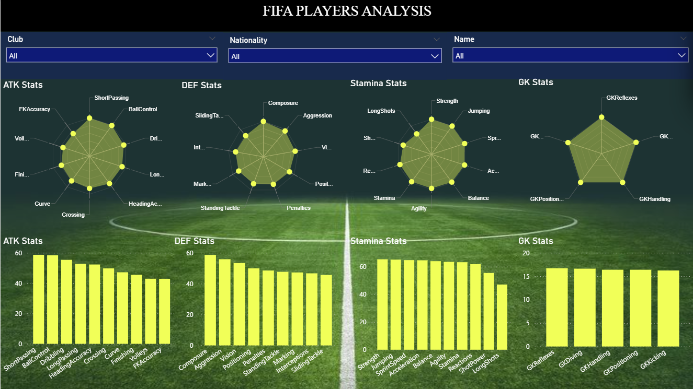

# Fifa Dashboard

Dashboard is in Fifa_dashboard folder.

An interactive dashboard built with Power BI for analyzing player data from FIFA 22. It provides in-depth visualizations and insights into player statistics, market values, wages, physical attributes, positions, nationalities, and skill ratings. The dashboard is designed for football enthusiasts, data analysts, and FIFA gamers to explore trends and top performers.

Page 1: General Player Stats

Page 2: Value and Release Clause

Page 3: Wage and Club Trends

Page 4: Skill Stats

